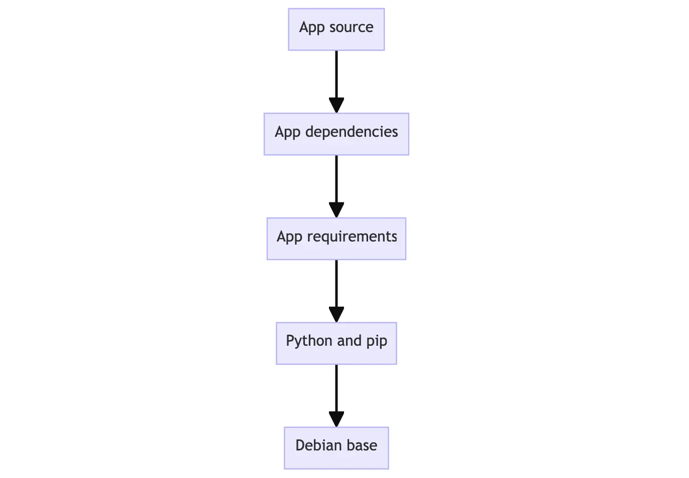

# What is Docker?

Docker is an open platform for developing, shipping, and running applications. Docker enables you to separate your applications from your infrastructure so you can deliver software quickly. With Docker, you can manage your infrastructure in the same ways you manage your applications. By taking advantage of Docker's methodologies for shipping, testing, and deploying code, you can significantly reduce the delay between writing code and running it in production.

Docker is a tool that allows developers, sys-admins etc. to easily deploy their applications in a sandbox (called _containers_) to run on the **host operating system** i.e. Linux. The key benefit of Docker is that it allows users to **package an application with all of its dependencies** into a standardized unit for software development. Unlike virtual machines, containers do not have high overhead and hence enable more efficient usage of the underlying system and resources.

Docker provides the ability to package and run an application in a loosely isolated environment called a container. The isolation and security lets you **run many containers simultaneously on a given host**. Containers are lightweight and contain everything needed to run the application, so you don't need to rely on what's installed on the host. You can share containers while you work, and be sure that everyone you share with gets the same container that works in the same way.

Docker provides tooling and a platform to manage the lifecycle of your containers:

- Develop your application and its supporting components using containers.
- The container becomes the unit for distributing and testing your application.
- When you're ready, deploy your application into your production environment, as a container or an orchestrated service. This works the same whether your production environment is a local data center, a cloud provider, or a hybrid of the two.

## Docker architecture

Docker uses a **client-server architecture**. The Docker client talks to the **Docker daemon**, which does the heavy lifting of building, running, and distributing your Docker containers. The Docker client and daemon can run on the same system, or you can connect a Docker client to a remote Docker daemon. The Docker client and daemon communicate using a **REST API**, over UNIX sockets or a network interface. Another Docker client is **Docker Compose**, that lets you work with applications consisting of a set of containers.


### Docker Daemon

The Docker daemon (`dockerd`) listens for Docker API requests and manages Docker objects such as images, containers, networks, and volumes. A daemon can also communicate with other daemons to manage Docker services.

### Docker client

The Docker client (`docker`) is the primary way that many Docker users interact with Docker. When you use commands such as `docker run`, the client sends these commands to `dockerd`, which carries them out. The `docker` command uses the Docker API. The Docker client can communicate with more than one daemon.

### Docker desktop

Docker Desktop is an easy-to-install application for your Mac, Windows or Linux environment that enables you to **build and share containerized applications and microservices**. Docker Desktop includes the Docker daemon (`dockerd`), the Docker client (`docker`), Docker Compose, Docker Content Trust, Kubernetes, and Credential Helper.

### Docker registries

A Docker registry stores **Docker images**. Docker Hub is a public registry that anyone can use, and Docker looks for images on Docker Hub by default. You can even run your own **private registry**.

When you use the `docker pull` or `docker run` commands, Docker pulls the required images from your configured registry. When you use the `docker push` command, Docker pushes your image to your configured registry.

### Docker objects

When you use Docker, you are creating and using **images**, **containers**, **networks**, **volumes**, **plugins**, and other objects.

### Images

An image is a **read-only template** with instructions for **creating a Docker container**. Often, an image is based on another image, with some additional customization. For example, you may build an image which is based on the ubuntu image, but installs the Apache web server and your application, as well as the configuration details needed to make your application run.

You might create your own images or you might only use those created by others and published in a registry. To build your own image, you create a `Dockerfile` with a simple syntax for defining the **steps** needed to **create the image and run it**. Each instruction in a Dockerfile creates a **layer** in the image. When you change the Dockerfile and rebuild the image, only those layers which have changed are rebuilt. This is part of what makes images so lightweight, small, and fast, when compared to other virtualization technologies.

### Containers

A container is a **runnable instance of an image**. You can create, start, stop, move, or delete a container using the **Docker API** or **CLI**. You can connect a container to one or more networks, attach storage to it, or even create a new image based on its current state.

By default, a container is relatively well isolated from other containers and its host machine. You can control how isolated a container's network, storage, or other underlying subsystems are from other containers or from the host machine.

A container is defined by its image as well as any configuration options you provide to it when you create or start it. When a container is removed, any changes to its state that aren't stored in persistent storage disappear.

# Docker concepts

## Containers

Imagine you're developing a killer web app that has three main components - a React frontend, a Python API, and a PostgreSQL database. If you wanted to work on this project, you'd have to install Node, Python, and PostgreSQL.

How do you make sure you have the same versions as the other developers on your team? Or your CI/CD system? Or what's used in production?

How do you ensure the version of Python (or Node or the database) your app needs isn't affected by what's already on your machine? How do you manage potential conflicts

This is where containers come into play.

What is a container? Simply put, containers are **isolated processes** for each of your app's **components**. Each component - the frontend React app, the Python API engine, and the database - runs in its own isolated environment, completely isolated from everything else on your machine.

Here's what makes them awesome. Containers are:

- **Self-contained**. Each container has everything it needs to function with no reliance on any pre-installed dependencies on the host machine.
- **Isolated**. Since containers are run in isolation, they have minimal influence on the host and other containers, increasing the security of your applications.
- **Independent**. Each container is independently managed. Deleting one container won't affect any others.
- **Portable**. Containers can run anywhere! The container that runs on your development machine will work the same way in a data center or anywhere in the cloud!

### Containers vs. Virtual Machines (VM)

Without getting too deep, a VM is an **entire operating system** with its own kernel, hardware drivers, programs, and applications. Spinning up a VM only to isolate a single application is a lot of **overhead**.

A container is simply an **isolated process** with all of the files it needs to run. If you run multiple containers, they all share the same kernel, allowing you to run more applications on less infrastructure.

### Example

Open your CLI terminal and start a container by using the `docker run` command:

```docker
docker run -d -p 8080:80 docker/welcome-to-docker
```

The output from this command is the full container ID.

#### List containers

To view your running containers you can use this command:

```docker
docker ps
```

To view all the containers, including stopped ones:

```docker
docker ps -a
```

This container runs a web server that displays a simple website. When working with more complex projects, you'll run **different parts** in **different containers**. For example, a different container for the **frontend**, **backend**, and **database**.

#### Access the frontend

To access the frontend of this project, you can visit `localhost:8080`. When you launched the container, you exposed one of the container's ports onto your machine. Think of this as creating configuration to let you to connect through the isolated environment of the container.

#### Stop the container

To stop a running container you must first acquire the container's ID. Run `docker ps` to get the ID of the container. Then provide the container ID or name to the docker stop command:

```docker
docker stop <the-container-id>
```

> When referencing containers by ID, you don't need to provide the full ID. You only need to provide enough of the ID to make it unique.

## Images

Seeing a container is an isolated process, where does it get its files and configuration? How do you share those environments?

That's where container _images_ come in. A container image is a standardized **package** that includes all of the files, binaries, libraries, and configurations to run a container.

For a PostgreSQL image, that image will package the database binaries, config files, and other dependencies. For a Python web app, it'll include the Python runtime, your app code, and all of its dependencies.

There are two important principles of images:

1. Images are **immutable**. Once an image is created, it can't be modified. You can only make a new image or add changes on top of it.
2. Container images are **composed of layers**. Each layer represents a set of **file system changes** that add, remove, or modify files.

These two principles let you to **extend** or **add to** existing images. For example, if you are building a Python app, you can start from the Python image and add additional layers to install your app's **dependencies** and add **your code**. This lets you focus on your app, rather than Python itself.

### Finding images

Docker Hub is the default global marketplace for storing and distributing images. It has over 100,000 images created by developers that you can run locally. You can search for Docker Hub images and run them directly from Docker Desktop.

Docker Hub provides a variety of Docker-supported and endorsed images known as Docker Trusted Content. These provide fully managed services or great starters for your own images. These include:

1. Docker Official Images
2. Docker Verified Publishers
3. Docker-Sponsored Open Source

### Example

To search for and download an image, you can use this command:

```docker
docker search docker/welcome-to-docker
```

To pull the found image you can use this command:

```docker
docker pull docker/welcome-to-docker
```

### Image layers

You learned previously that container images are composed of **layers**. And each of these layers, once created, are **immutable**. But, what does that actually mean? And how are those layers used to **create the filesystem** a container can use?

Each layer in an image contains a set of filesystem changes - additions, deletions, or modifications. Let's look at a theoretical image:

1. The first layer adds basic commands and a package manager, such as `apt`.
2. The second layer installs a Python runtime and `pip` for dependency management.
3. The third layer copies in an application's specific **`requirements.txt`** file.
4. The fourth layer installs that application's specific **dependencies**.
5. The fifth layer copies in the actual **source code** of the application.



This is beneficial because it allows layers to be reused between images. For example, imagine you wanted to create another Python application. Due to layering, you can leverage the same Python base. This will make builds faster and reduce the amount of storage and bandwidth required to distribute the images.


Layers let you **extend images of others** by reusing their base layers, allowing you to add only the data that your application needs.

#### Stacking the layers

Layering is made possible by **content-addressable storage** and **union filesystems**. While this will get technical, here is how it works:

1. After each layer is downloaded, it is **extracted into its own directory** on the host filesystem.
2. When you run a container from an image, a **union filesystem** is created where layers are stacked on top of each other, creating a new and **unified view**.
3. When the container starts, its root directory is set to the location of this unified directory, using `chroot`.

When the union filesystem is created, in addition to the image layers, a directory is created specifically for the running container. This allows the container to **make filesystem changes while allowing the original image layers to remain untouched**. This enables you to **run multiple containers from the same underlying image**.

#### Writing a Dockerfile

A Dockerfile is a **text-based document** that's used to **create a container image**. It provides **instructions** to the image builder on the commands to run, files to copy, startup command, and more.

Look at this example:

```docker
FROM python:3.12
WORKDIR /usr/local/app

# Install the application dependencies
COPY requirements.txt ./
RUN pip install --no-cache-dir -r requirements.txt

# Copy in the source code
COPY src ./src
EXPOSE 5000

# Setup an app user so the container doesn't run as the root user
RUN useradd app
USER app

CMD ["uvicorn", "app.main:app", "--host", "0.0.0.0", "--port", "8080"]
```

##### Common instructions

Some of the most common instructions in a `Dockerfile` are:

- `FROM <image>`: this specifies the base image that the build will extend.
- `WORKDIR <path>`: this instruction specifies the "working directory" or the path in the image where files will be copied and commands will be executed.
- `COPY <host-path> <image-path>`: this instruction tells the builder to copy files from the host and put them into the container image.
- `RUN <command>`: this instruction tells the builder to run the specified command.
- `ENV <name> <value>`: this instruction sets an environment variable that a running container will use.
- `EXPOSE <port-number>`: this instruction sets configuration on the image that indicates a port the image would like to expose.
- `USER <user-or-uid>`: this instruction sets the default user for all subsequent instructions.
- `CMD ["<command>", "arg1"]`: this instruction sets the default command a container using this image will run.

### List your pulled docker images

List your downloaded images using the `docker image ls` command:

```docker
docker image ls
```

### List image layers

To list the layers of an image file you can use this command:

```docker
docker image history docker/welcome-to-docker
```

## Registry

Where do you store images? Well, you can store your container images on your computer system, but what if you want to **share** them with your friends or use them on another machine? That's where the **image registry** comes in.

An image registry is a centralized location for storing and sharing your container images. It can be either public or private. **Docker Hub** is a public registry that anyone can use and is the default registry.

### Example

Try this example: https://docs.docker.com/get-started/docker-concepts/the-basics/what-is-a-registry/

## Docker compose

Imagine you want to run databases, message queues, caches, or a variety of other services. Do you install everything in a single container? Run **multiple containers**? If you run multiple, how do you **connect them all together**?

One best practice for containers is that **each container should do one thing** and do it well. While there are exceptions to this rule, avoid the tendency to have one container do multiple things.

You can use multiple docker run commands to start multiple containers. But, you'll soon realize you'll need to manage networks, all of the flags needed to connect containers to those networks, and more. And when you're done, cleanup is a little more complicated.

With Docker Compose, you can define all of your containers and their configurations in a single `YAML` file. If you include this file in your code repository, anyone that clones your repository can **get up and running with a single command**.

It's important to understand that Compose is a **declarative** tool - you simply define it and go. You don't always need to recreate everything from scratch. If you make a change, run `docker compose up` again and Compose will reconcile the changes in your file and apply them intelligently.
