Mermaid is a **text-based diagram language**. Instead of drawing boxes and arrows manually in tools like Visio or draw.io, you write a few lines of text, and Mermaid generates the diagram.

It is widely used in:

- GitHub Markdown
- GitLab
- Obsidian
- Notion (partially)
- VS Code
- Documentation websites (Docusaurus, MkDocs, etc.)

If you're a web developer, you'll probably use it to document APIs, application architecture, authentication flows, deployment pipelines, and database relationships.

---

# Step 1: Install Mermaid support in VS Code

The easiest way is to install the **Markdown Preview Mermaid Support** extension.

After installing it:

1. Create a Markdown file

```text
diagram.md
```

2. Write Mermaid inside a fenced code block

````markdown

````

3. Open Markdown Preview

Press

```
Ctrl + Shift + V
```

or

```
Ctrl + K
V
```

You'll immediately see the rendered diagram.

---

# Step 2: Your First Flowchart

````markdown
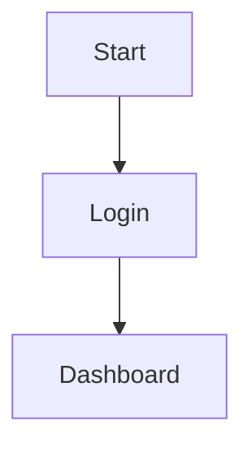
````

Result:

```
+--------+
| Start  |
+--------+
     |
     v
+--------+
| Login  |
+--------+
     |
     v
+------------+
| Dashboard  |
+------------+
```

The real Mermaid version is much prettier.

---

# Step 3: Understanding `flowchart`

```
flowchart TD
```

means

```
flowchart
```

and

```
TD
```

means

```
Top
↓

Down
```

There are several directions.

### Top to Bottom

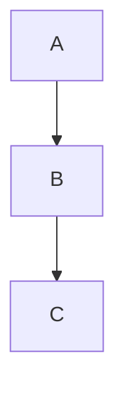

---

### Bottom to Top

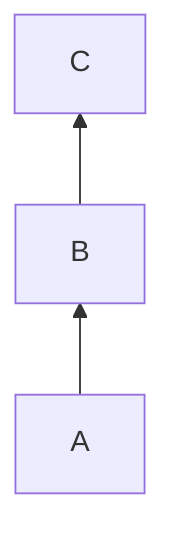

---

### Left to Right

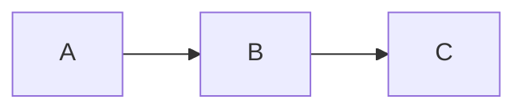

---

### Right to Left

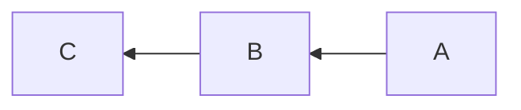

---

# Step 4: Creating Nodes

Every box has an ID.

```
A
B
C
```

These IDs are internal.

The displayed text comes afterward.

Example:

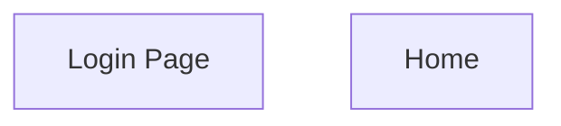

Here

```
login
```

is the identifier.

```
Login Page
```

is what users see.

---

# Step 5: Different Shapes

## Rectangle

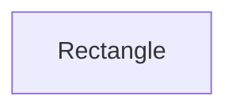

---

## Rounded Rectangle

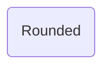

---

## Circle

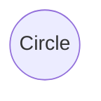

---

## Diamond (Decision)

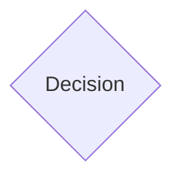

Very common for if-statements.

---

## Stadium

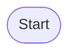

Often used for Start/End.

---

## Subroutine

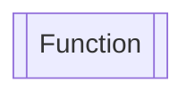

Useful for function calls.

---

# Step 6: Connecting Nodes

Simple arrow


---

Arrow with text

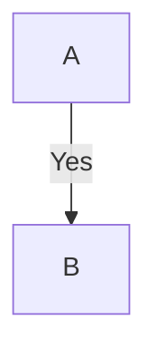

---

Another branch

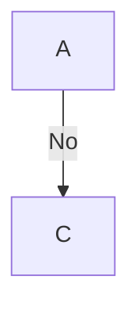

---

Dotted line

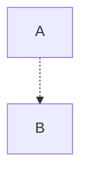

---

Thick line

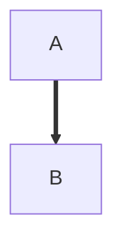

---

No arrow

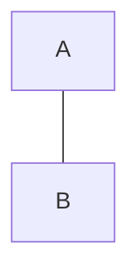

---

# Step 7: Decisions (if/else)

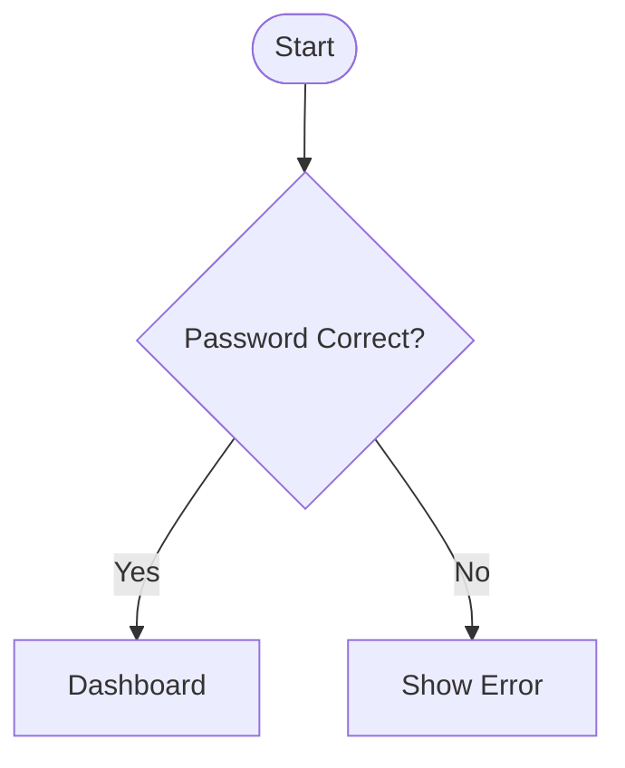

This is probably the most common flowchart pattern.

---

# Step 8: Loops

Suppose login fails.

```mermaid
flowchart TD

Start([Start])

Login[Enter Password]

Check{Correct?}

Dashboard[Dashboard]

Error[Show Error]

Start --> Login

Login --> Check

Check -->|Yes| Dashboard

Check -->|No| Error

Error --> Login
```

Notice the last line:

```
Error --> Login
```

That creates a loop.

---

# Step 9: Multiple Inputs

```mermaid
flowchart TD

A --> C

B --> C

C --> D
```

---

# Step 10: Multiple Outputs

```mermaid
flowchart TD

A --> B

A --> C

A --> D
```

---

# Step 11: Subgraphs (Groups)

Useful for microservices or application layers.

```mermaid
flowchart LR

subgraph Frontend

A[React]

B[Next.js]

end

subgraph Backend

C[Express]

D[PostgreSQL]

end

A --> C

B --> C

C --> D
```

---

# Step 12: Real Example (Authentication)

```mermaid
flowchart TD

User([User])

Login[Login Form]

API[POST /login]

DB[(Database)]

JWT[Generate JWT]

Dashboard[Dashboard]

Error[Unauthorized]

User --> Login

Login --> API

API --> DB

DB --> API

API -->|Valid| JWT

JWT --> Dashboard

API -->|Invalid| Error
```

---

# Step 13: Real Example (Node.js Request)

```mermaid
flowchart LR

Browser --> Express

Express --> Middleware

Middleware --> Controller

Controller --> Service

Service --> Repository

Repository --> PostgreSQL

PostgreSQL --> Repository

Repository --> Service

Service --> Controller

Controller --> Express

Express --> Browser
```

This closely matches the architecture of many Express applications.

---

# Step 14: Real Example (Next.js)

```mermaid
flowchart TD

User

Browser

Next

API

Database

User --> Browser

Browser --> Next

Next --> API

API --> Database

Database --> API

API --> Next

Next --> Browser
```

---

# Step 15: Comments

Use

```text
%%
```

Example

```mermaid
flowchart TD

%% Authentication flow

A --> B
```

---

# Step 16: Styling

You can color nodes.

```mermaid
flowchart TD

A[Success]

style A fill:#90EE90
```

Or

```mermaid
flowchart TD

A[Error]

style A fill:#FF9999
```

---

# Step 17: Node IDs

You can reference the same node repeatedly without redefining its label.

```mermaid
flowchart TD

login[Login]

dashboard[Dashboard]

login --> dashboard

dashboard --> login
```

---

# Step 18: A Larger Real-World Example

Here's a simplified login flow for a React + Express application:

````markdown
```mermaid
flowchart TD

Start([User Opens App])

Home[Login Page]

Submit[Submit Credentials]

API[POST /login]

Check{Credentials Valid?}

JWT[Issue JWT]

Store[Store Token]

Dashboard[Dashboard]

Error[Display Error]

Start --> Home
Home --> Submit
Submit --> API
API --> Check
Check -->|Yes| JWT
JWT --> Store
Store --> Dashboard
Check -->|No| Error
Error --> Home
```
````

This combines several concepts you've learned:

- Different node shapes
- Labels on arrows
- Decision diamonds
- A loop back after an error

---

# Mermaid Cheat Sheet

| Syntax                  | Meaning                   |
| ----------------------- | ------------------------- |
| `flowchart TD`          | Top → Bottom layout       |
| `flowchart LR`          | Left → Right layout       |
| `A --> B`               | Arrow                     |
| `A -->\|Yes\| B`        | Arrow with label          |
| `A --- B`               | Line without arrow        |
| `A -.-> B`              | Dotted arrow              |
| `A ==> B`               | Thick arrow               |
| `A[Text]`               | Rectangle                 |
| `A(Text)`               | Rounded rectangle         |
| `A((Text))`             | Circle                    |
| `A{Text}`               | Diamond (decision)        |
| `A([Text])`             | Stadium (often Start/End) |
| `A[[Text]]`             | Subroutine                |
| `subgraph Name ... end` | Group related nodes       |
| `style A fill:#90EE90`  | Style a node              |
| `%% comment`            | Comment                   |

## Best practices

- Give nodes meaningful IDs (`loginForm`, `validateUser`) rather than single letters in larger diagrams.
- Keep the flow in a single direction (usually `TD` or `LR`) to minimize crossing arrows.
- Use diamonds only for decisions and label outgoing branches (`Yes`, `No`, `Success`, `Failure`).
- Group related components with `subgraph` when documenting layered or distributed systems.
- As diagrams grow, split them into smaller, focused diagrams rather than creating one very large flowchart.

Once you're comfortable with flowcharts, Mermaid also supports **sequence diagrams**, **class diagrams**, **ER diagrams**, **state diagrams**, **Gantt charts**, **git graphs**, **journey maps**, and more using the same text-first approach.
