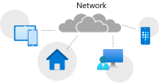
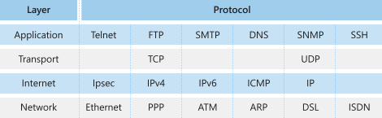
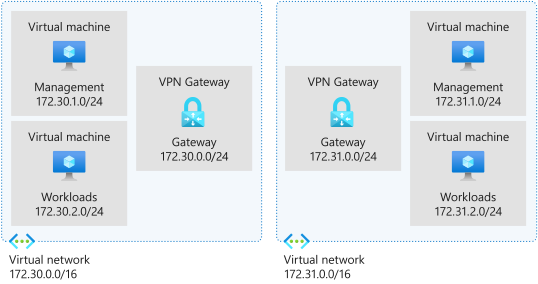

- [Network protocols to use when you implement a network](#network-protocols-to-use-when-you-implement-a-network)
  - [Network protocols](#network-protocols)
  - [What is a network address?](#what-is-a-network-address)
    - [Media Access Control (MAC)](#media-access-control-mac)
    - [Internet Protocol (IP)](#internet-protocol-ip)
  - [What is a data packet?](#what-is-a-data-packet)
  - [What is routing?](#what-is-routing)
  - [Protocol categories](#protocol-categories)
    - [Network communication protocols](#network-communication-protocols)
      - [Transmission Control Protocol (TCP)](#transmission-control-protocol-tcp)
      - [Internet Protocol (IP)](#internet-protocol-ip-1)
      - [User Datagram Protocol (UDP)](#user-datagram-protocol-udp)
      - [Hypertext Transfer Protocol (HTTP)](#hypertext-transfer-protocol-http)
      - [File Transfer Protocol (FTP)](#file-transfer-protocol-ftp)
      - [Post Office Protocol 3 (POP3)](#post-office-protocol-3-pop3)
      - [Simple Mail Transfer Protocol (SMTP)](#simple-mail-transfer-protocol-smtp)
      - [Interactive Mail Access Protocol (IMAP)](#interactive-mail-access-protocol-imap)
    - [Network security protocols](#network-security-protocols)
      - [Secure Socket Layer (SSL)](#secure-socket-layer-ssl)
      - [Transport Layer Security (TLS)](#transport-layer-security-tls)
      - [Hypertext Transfer Protocol Secure (HTTPS)](#hypertext-transfer-protocol-secure-https)
      - [Secure Shell (SSH)](#secure-shell-ssh)
      - [Kerberos](#kerberos)
    - [Network management protocols](#network-management-protocols)
      - [Simple Network Management Protocol (SNMP)](#simple-network-management-protocol-snmp)
      - [Internet Control Message Protocol (ICMP)](#internet-control-message-protocol-icmp)
    - [Ports](#ports)
      - [Well-known port numbers](#well-known-port-numbers)
  - [Internet Protocol Suit](#internet-protocol-suit)
    - [Application layer](#application-layer)
    - [Transport layer](#transport-layer)
    - [Internet layer](#internet-layer)
    - [Network access layer](#network-access-layer)
- [IP address standards and services](#ip-address-standards-and-services)
  - [What is the Address Resolution Protocol (ARP)?](#what-is-the-address-resolution-protocol-arp)
  - [What is TCP/IP?](#what-is-tcpip)
    - [TCP/IP model layers](#tcpip-model-layers)
      - [Application layer](#application-layer-1)
      - [Transport layer](#transport-layer-1)
      - [Internet layer (also called network layer)](#internet-layer-also-called-network-layer)
      - [Network access layer](#network-access-layer-1)
  - [What are the Internet Protocol standards?](#what-are-the-internet-protocol-standards)
    - [IPv4](#ipv4)
      - [Structure of an IPv4 address](#structure-of-an-ipv4-address)
      - [Parts of an IPv4 address](#parts-of-an-ipv4-address)
      - [IPv4 address classes](#ipv4-address-classes)
        - [What is a subnet?](#what-is-a-subnet)
      - [IPv4 address space exhaustion](#ipv4-address-space-exhaustion)
      - [Private IP addressing](#private-ip-addressing)
    - [IPv6](#ipv6)
      - [Structure of an IPv6 address](#structure-of-an-ipv6-address)
  - [DNS](#dns)


# Network protocols to use when you implement a network

## Network protocols

A network protocol is a set of **conditions** and **rules** that specify how network devices communicate on a given network. It provides a common framework for establishing and maintaining a **communications channel**, and how to handle errors or faults should they occur. Network protocols allow communication between different network-enabled devices, such as laptops, tablets, smartphones, desktops, servers, and other network-enabled devices.



The network protocol is an essential building block in the design of an organization's network architecture. There are several network protocols available. Each network protocol has many properties that govern its use and implementation.

Let's define a few terms before we look at some of the commonly used network protocols.

## What is a network address?

A network address is a unique identifier that identifies a network-enabled device. A network-enabled device might have more than one address type. For this discussion, we focus on only two address types.

The first type is a **media access control (MAC)** address that identifies the network interface on the hardware level. The second type is an **Internet Protocol (IP)** address that identifies the network interface on a software level.

### Media Access Control (MAC)

### Internet Protocol (IP)

## What is a data packet?

A data packet is a unit that's used to describe the message that two devices on a network send each other. A data packet consists of **raw data**, **headers**, and potentially a **trailer**. The header contains several information items. For example, it includes the **sender and destination device addresses**, the **size** of the packet, the **protocol** used, and the **packet number**. The trailer in a data packet deals with error checking.

The concept is similar to sending someone a letter in the mail one section at a time. For example, instead of sending several pages in one envelope, each page is sent in a separate envelope. Enough information is sent in each envelope to allow the recipient to piece together the complete message after receiving all the pages.

## What is routing?

Routing, in the context of networks, refers to the mechanism used to make sure that **data packets follow the correct delivery path** between the sending and receiving devices on different networks.

For example, think about the PC you're using and the server that's serving the page you're currently reading. Multiple networks might connect your PC and the server, and various paths might be available between these two devices.

## Protocol categories

Several types of applications and hardware devices depend on specific network protocols on a typical network. For example, browsing the internet by using a web browser relies on a different protocol than sending or receiving an email. Converting the data that you see in the browser and sending this information over the network requires another protocol.

Protocols fall into three categories:

- Network **communication** protocols
- Network **security** protocols
- Network **management** protocols

### Network communication protocols

Communication protocols focus on **establishing and maintaining a connection between devices**. As you work with different devices and network services, you use various network communication protocols.

First, we need to define three foundational protocols of all internet-based networks. These three protocols are **Transmission Control Protocol (TCP)**, **Internet Protocol (IP)**, and **User Datagram Protocol (UDP)**. These protocols deal with the logical transmission of data over the network.

#### Transmission Control Protocol (TCP)

TCP **divides data into data packets** that can be sent **securely** and **quickly** while **minimizing the chance of data loss**. It provides a stable and reliable mechanism for the **delivery of data packets across an IP-based network**. Even though TCP is an effective connection-oriented protocol, it has overhead.

#### Internet Protocol (IP)

IP is responsible for the **addressing of a data packet**. IP **encapsulates** the data packet to be delivered and adds an **address header**. The header contains information on the **sender and recipient IP addresses**. This protocol isn't concerned about the order in which the packets are sent or received. It also doesn't guarantee that a packet is delivered, only the address.

#### User Datagram Protocol (UDP)

UDP is a connectionless protocol that offers a low-latency and loss-tolerant implementation. UDP is used with processes that don't need to verify that the recipient device received a datagram.

***

The rest of the protocols that we discuss here are based on a type of application, such as an **email client** or a **web browser**. Here are the most commonly used network communication protocols:

#### Hypertext Transfer Protocol (HTTP)

The HTTP protocol uses **TCP/IP** to **deliver web page content** from a server to your browser. HTTP can also handle the **download** and **upload** of files from remote servers.

#### File Transfer Protocol (FTP)

FTP is used to **transfer files between different computers on a network**. Typically, you'd use FTP to upload files to a server from a remote location. While you can use FTP to download files, web-based downloads are typically handled through HTTP.

#### Post Office Protocol 3 (POP3)

POP3 is one of three **email protocols** and is most commonly used by an email client to allow you to **receive emails**. This protocol uses **TCP** for the management and **delivery** of an email.

#### Simple Mail Transfer Protocol (SMTP)

SMTP is another one of the three **email protocols** and is most commonly used to **send emails** from an email client via an email server. This protocol uses **TCP** for management and **transmission** of the email.

#### Interactive Mail Access Protocol (IMAP)

IMAP is the **more powerful** of the three email protocols. With IMAP and an email client, you can **manage a single mailbox on an email server** in your organization.

### Network security protocols

Network security protocols are designed to **maintain the security of data across your network**. These protocols **encrypt in-transmission messages** between users, services, and applications.

Network security protocols use **encryption** and **cryptographic** principles to secure messages.

To implement a secure network, you must match the right security protocols for your needs. The following list explores the leading network security protocols:

#### Secure Socket Layer (SSL)

SSL is a standard encryption and security protocol. It provides a **secure and encrypted connection between your computer and the target server or device that you accessed over the internet**.

#### Transport Layer Security (TLS)

TLS is the successor to SSL, and provides a stronger and more robust security encryption protocol. Based on the Internet Engineering Task Force (IETF) standard, it helps **stop message forgery**, **tampering**, and **eavesdropping** and is typically used to **protect web browser communications**, **email**, **VoIP**, and **instant messaging**. While TLS is now used, the replacement security protocol is often still called SSL.

#### Hypertext Transfer Protocol Secure (HTTPS)

HTTPS provides a **more secure version of the standard HTTP** protocol by using the **TLS** or **SSL** encryption standard. This combination of protocols **ensures that all data transmitted between the server and the web browser is encrypted and secure from eavesdropping or data packet sniffing**. The same principle is applied to the POP, SMTP, and IMAP protocols listed previously to create secure versions known as POPS, SMTPS, and IMAPS.

#### Secure Shell (SSH)

SSH is a **cryptographic network security protocol** that provides a **secure data connection across a network**. SSH is designed to **support command-line execution of instructions**, which includes **remote authentication to servers**. FTP uses many of the SSH functions to provide a secure file transfer mechanism.

#### Kerberos

This **validation protocol** provides a **robust authentication** for **client-server-based applications** through **secret-key cryptography**. Kerberos assumes that all endpoints in the network are insecure. It constantly enforces strong encryption for all communications and data.

### Network management protocols

In your network, it's perfectly acceptable to have multiple different protocols running concurrently. Previously, we discussed communications and security protocols. Equally important to the successful day-to-day running and operating of a network are the management protocols. The focus of this type of protocol is the **sustainability of the network** by looking at **faults** and **performance**.

Network administrators need to **monitor their networks and any devices attached to them**. Each device in your network exposes some **indicators** about the **state** and **health** of the device. The network administrator tool requests these indicators and uses them for monitoring and reporting.

Two network management protocols are available:

#### Simple Network Management Protocol (SNMP)

SNMP is an internet protocol that **allows for the collection of data from devices on your network and the management of those devices**. The device has to support SNMP to gather information. Devices that support SNMP typically include **switches**, **routers**, **servers**, **laptops**, **desktops**, and **printers**.

#### Internet Control Message Protocol (ICMP)

ICMP is one of the protocols included within the **Internet Protocol Suite (IPS)**. It **allows network-connected devices to send warning and error messages**, along with **operation information about the success or failure of a connection request**, or **if a service is unavailable**. Unlike other network transport protocols, like UDP and TCP, ICMP **isn't used to send or receive data from devices on the network**.

### Ports

A port is a logical construct that **allows the routing of incoming messages to specific processes**. There's a particular port for every type of IPS. A port is an **unsigned 16-bit** number in the **range 0 to 65535**, and is also known as a *port number*. Based on the communications protocol used, the sending TCP or UDP layer assigns the ports.

There are specific port numbers **reserved** for every service. The *first 1,024 ports*, called the *well-known port numbers*, are reserved for the commonly used services. The *high-numbered ports*, called the ephemeral ports, are unreserved and used by dedicated applications.

**Every port links to a specific service or communications protocol**. It means that the target network device, like a server, can receive multiple requests on each port and service each of them without conflict.

#### Well-known port numbers

Much in the same way that IP addresses are split into classes, so are ports. There are three ranges of ports: the **well-known ports**, the **registered ports**, and the **dynamic/private ports**.

The **Internet Assigned Numbers Authority (IANA)** manages the allocation of port numbers, the regional assignment of IP addresses, and Domain Name System (DNS) root zones. IANA also manages a central repository for protocol names and the registry used in internet protocols.

Refer to the address below for a table of well-known port numbers:

```
https://learn.microsoft.com/en-us/training/modules/network-fundamentals/4-network-protocols
```

## Internet Protocol Suit

The Internet Protocol suite is a **collection of communication protocols**, also called a **protocol stack**. It can be referred to as the TCP/IP protocol suite, because both TCP and IP are primary protocols used in the suite.

The IPS is an abstract, layered networking reference model. The IPS **describes the different layered protocols used to send and receive data on the internet and similar networks**.

The IPS model is one of several similar networking models that varies between three and seven layers. The best-known model is the **Open Systems Interconnection (OSI)** networking reference model.

For more information on OSI refer to the link below:

```
https://en.wikipedia.org/wiki/OSI_model
```



### Application layer

The top layer of this stack is concerned with **application or process communication**. The application layer is **responsible for determining which communication protocols to use based on what type of message is transmitted**. For example, the layer assigns the correct email protocols such as POP, SMTP, or IMAP if the message is email content.

### Transport layer

This layer is responsible for **host-to-host communication on the network**. The protocols associated with this layer are **TCP** and **UDP**. TCP is responsible for flow control. UDP is responsible for providing a datagram service.

### Internet layer

This layer is **responsible for exchanging datagrams**. A datagram contains the data from the transport layer and **adds in the origin and recipient IP addresses**. The protocols associated with this layer are **IP**, **ICMP**, and the **Internet Protocol Security (IPsec)** suite.

### Network access layer

The bottom layer of this stack is **responsible for defining how the data is sent across the network**. The protocols associated with this layer are **Address Resolution Protocol (ARP)**, **MAC**, **Ethernet**, **DSL**, and **ISDN**.

# IP address standards and services

 The next step in understanding the composition of a network is to take a detailed look at the interoperability of your network. This knowledge applies whether it's your organization's network, or more extensive networks like the web. All networks are built on the same principles.

 In this unit, we examine the main aspects of network communications and why networks are built by using the Transmission Control Protocol/Internet Protocol (TCP/IP). Then, we discuss the differences between Internet Protocol address standards. Finally, we explore subnetting, the Domain Name System (DNS), ports, and the use and role of private IP addresses.

 ## What is the Address Resolution Protocol (ARP)?

 The Address Resolution Protocol (ARP) is a communications protocol within the Internet Protocol suite. It's a **request-response protocol** used to **resolve the media access control (MAC) address for a given IP address**. ARP supports many data link layer technologies, such as **Internet Protocol version 4 (IPv4)**, DECnet, and PUP. When an **Internet Protocol version 6 (IPv6)** address is resolved, the **Neighbor Discovery Protocol (NDP)** is used instead of ARP. Without ARP, there would be no means to resolve an IP address to a physical device address.
 
 There's also the **Reverse Address Resolution Protocol (RARP)**, which retrieves an IP address based on the given MAC address.

 ## What is TCP/IP?

 The Transmission Control Protocol/Internet Protocol is a collection of different communication protocols that support and **define how network-enabled devices interconnect with each other over an IP-based network**. At its heart are two key protocols: TCP and IP. **TCP/IP makes the internet possible**, including **private and public networks**, such as intranets and extranets.

 TCP/IP **defines the way data is shared between network-enabled devices** by defining the **end-to-end communication process**. It **manages how the message is broken down into packets of data**, which are sometimes known as **datagrams**. TCP/IP also determines **how the packet is addressed and transmitted, routed, and received**. TCP/IP can determine the most efficient route across a network.

 The TCP/IP model is designed to be **stateless**. This design means the **network stack treats each request as new because it isn't related to the previous request**. However, one part of the TCP/IP model isn't stateless. The **transport layer operates in a stateful mode** because it **maintains a connection until all the packets in the message are received**.

 TCP/IP is an **open standard**. TCP/IP is governed, but **no single organization owns it**, so it works with all operating systems, networks, and hardware.

 ### TCP/IP model layers

 The TCP/IP model is made up of four distinct layers. Each layer uses a different type of protocol. Notice how the TCP/IP model is similar to the Internet Protocol suite discussed earlier.

 #### Application layer

 The application layer determines which communication protocols are used. This layer includes HyperText Transfer Protocol (HTTP), DNS, File Transfer Protocol (FTP), Internet Message Access Protocol (IMAP), Lightweight Directory Access Protocol (LDAP), Post Office Protocol (POP), Simple Mail Transfer Protocol (SMTP), Simple Network Management Protocol (SNMP), Secure Shell (SSH), Telnet, and TLS/SSL.

 #### Transport layer

 This layer **splits the application data into manageable ordered chunks** by using the right **port** for the application protocol used. The protocols associated with this layer are **TCP** and the **User Datagram Protocol (UDP)**.

 #### Internet layer (also called network layer)

 This layer **ensures the data packet gets to its destination**. The protocols associated with this layer are **IP**, **IPv4**, **IPv6**, **Internet Control Message Protocol (ICMP)**, and **Internet Protocol Security (IPsec)**.

 #### Network access layer
 
 This layer is **responsible for defining how the data is sent across the network**. The protocols associated with this layer are *ARP*, **MAC**, **Ethernet**, **Digital Subscriber Line (DSL)**, and **Integrated Services Digital Network (ISDN)**.

 ## What are the Internet Protocol standards?

 Recall from earlier that the Internet Protocol isn't concerned about the order in which the packets are sent or received. It also doesn't guarantee a packet's delivery. The Internet Protocol only provides a logical addressing system that's used to route and forward messages to their destinations.

Today, there are two Internet Protocol versions that work within networks: IPv4 and IPv6.

### IPv4

Internet Protocol version 4 was released in 1983, and is the **standard for all packet-switch-based networks** in use today. IPv4 uses a **32-bit address space** that gives an upper limit of 4,294,967,296 (4.3 billion) unique logical IP addresses. A large number of these available IP addresses are **reserved** for a specific purpose, such as **private networks**, **local hosts**, **internet relays**, **documentation**, and **

#### Structure of an IPv4 address

The structure of an IPv4 address is **four decimal numbers** in the range of **0 to 255**, each **separated with a dot**. This structure is also known as the *dotted-decimal format*. An example of an IP address is 192.168.0.1.

#### Parts of an IPv4 address

There are two parts to an IP address, the **network** and the **host**. Let's use the address `192.168.0.1` as an example.

The network part of an IP address covers the **first set of decimal numbers**. In the example, that's `192.168.0`. This number is **unique to the network** and specifies the **class of the network**. There are many network classes available, as described in the following section.

The host part of the IP address covers the next set of decimal numbers. In the example, that's `1`. This number **represents the device** and must be **unique within the network** to avoid address conflicts. Each device on a network segment must have a unique address.

#### IPv4 address classes

The Internet Protocol's local address space is split into five logical classes or ranges of IP addresses, each represented by a letter of the alphabet.

| Class | Start address | End address     | Number of networks | IP addresses per network | Total IP addresses available | Subnet mask   |
|-------|---------------|-----------------|--------------------|--------------------------|------------------------------|---------------|
| A     | 0.0.0.0       | 127.255.255.255 | 128                | 16,777,216               | 2,147,483,648                | 255.0.0.0     |
| B     | 128.0.0.0     | 191.255.255.255 | 16,384             | 65,536                   | 1,073,741,824                | 255.255.0.0   |
| C     | 192.0.0.0     | 223.255.255.255 | 2,097,152          | 256                      | 536,870,912                  | 255.255.255.0 |
| D     | 224.0.0.0     | 239.255.255.255 | -                  | -                        | 268,435,456                  | -             |
| E     | 240.0.0.0     | 255.255.255.255 | -                  | -                        | 268,435,456                  | -             |

For classes A, B, and C, the start and end IP addresses are reserved and shouldn't be used. Class D is reserved for multicast traffic only. Class E is reserved and can't be used on public networks like the internet.

In the previous table, the last column is marked as a subnet mask. The subnet mask uses the same format as the IP address, but its purpose is to **identify valid IP addresses in an IP range**.

For example, assume you have an IP address range that starts at `192.168.0.1`, and you have a subnet of `255.255.255.0`. You apply the subnet mask in the following way. For each address segment value specified as 255 in the mask, the corresponding address segment is **static**. When you want to pick an IP address, you must pick an address that matches `192.168.0`. Where the segment has a value of `0`, you can use any value **between 0 to 255**. A subnet mask of `255.255.255.0` gives an IP address range of `192.168.0.0` to `192.168.0.255`, which are valid values to select.

##### What is a subnet?

<!-- READ AGAIN -->

A subnet defines one or more logical networks within the class A, B, or C network. Without subnets, you can only have a single network in each of the class A, B, or C networks.

An IP address, also known as a network address or routing prefix, represents the address of the device or computer to send the packet of data. A subnet, or host address, represents which network or subnetwork to use. A subnet is a 32-bit number framed by using the dotted-decimal format. For example, 255.255.255.0 is a standard subnet mask.

In an IPv4 network, for a packet of data to be routed to the correct network and network device, a routing prefix is needed. A routing prefix is created by taking the subnet mask and applying a bitwise `AND` to the IP address.

A more common way to define the subnet and the routing prefix is to use the Classless Interdomain Routing (CIDR) notation. CIDR applies to the IP address as the number of bits you want to allocate to your subnet. Using CIDR notation, at the end of the IP address, add a "/" and then the number of bits. For example, 198.51.100.0/24 is the same as using the dotted-decimal format subnet mask 255.255.255.0. It offers an address range of 198.51.100.0 to 198.51.100.255.



Subnets allow multiple subnetworks to exist within one network. They can be used to enhance routing performance. Subnets can be arranged hierarchically to create routing trees.

#### IPv4 address space exhaustion

Soon after the introduction of IPv4, it became apparent that the pool of available IP addresses was being consumed faster than was expected. For example, think about the number of mobile devices that were released in the last couple of years.

Several solutions were introduced to mitigate the threat of running out of IP addresses. These ideas included network address translation (NAT), classful networks, and CIDR. In the 1990s, IPv6 was created to increase the number of IP address spaces to 128 bits. IPv6 was introduced commercially in 2006.

#### Private IP addressing

In classes A, B, and C, a range of IP addresses are set aside for private networks. These IP ranges aren't accessible via the internet. All public routers ignore any packets sent to them containing such an address.

| Name         | CIDR block     | Address range               | Number of addresses | Classful description                   |
|--------------|----------------|-----------------------------|---------------------|----------------------------------------|
| 24-bit block | 10.0.0.0/8     | 10.0.0.0–10.255.255.255     | 16,777,216          | Single class A                         |
| 20-bit block | 172.16.0.0/12  | 172.16.0.0–172.31.255.255   | 1,048,576           | Contiguous range of 16 class B blocks  |
| 16-bit block | 192.168.0.0/16 | 192.168.0.0–192.168.255.255 | 65,536              | Contiguous range of 256 class C blocks |

Network devices on a private network can't communicate with devices on a public network. Communication can happen only through network address translation at a routing gateway.

The only way to connect two private networks in different geographical areas is to use a **virtual private network (VPN)**. A VPN encapsulates each private network packet. The VPN can further **encrypt the packet before it sends it across a public network** from one private network to another private network.

### IPv6

Internet Protocol version 6 is the latest version of the IP standard. The Internet Engineering Task Force (IETF), designed and developed IPv6 to address the problem of IPv4 logical address exhaustion. It was intended to eventually replace the IPv4 standard. It was adopted as a recognized internet standard in July 2017.

IPv6 uses a 128-bit address space, which allows 2128 addresses. This amount is approximately 7.9x1028 times more than IPv4.

IPv4 and IPv6 weren't designed to be interoperable, which slowed down the transition to the newer IPv6 standard.

IPv6 also introduced several benefits:

- Simplified network configuration: IPv6 has address autoconfiguration built into the protocol. For example, a router broadcasts the network prefix, and the network device can append its MAC address to self-assign a unique IPv6 address.
- Security: IPsec is built into IPv6.
- New service support: IPv6 eliminates the need for NAT, which makes it easier to create peer-to-peer networks.
- Multicast and anycast functionality: Multicast allows for the broadcast of messages in a one-to-many fashion. Anycast allows a single destination to have multiple routing paths to two or more endpoint destinations.

#### Structure of an IPv6 address

The structure of IPv6 is different from IPv4. Instead of four decimal numbers, it uses eight groups of four hexadecimal numbers called a hexadectet. Each hexadectet is separated with a colon. A full IPv6 address looks like this:

```
2001:0db8:0000:0000:0000:8a2e:0370:7334
```

The new standard allows for the address to be simplified by using the following rules:

- One or more leading zeros from any group can be removed, so `0042` becomes `42`.
- Consecutive sections of zeros are replaced with a double colon (`::`), which can be used only once in an address.

The shortened version of the IPv6 example is `2001:db8::8a2e:370:7334`. Notice that all the instances of `0000` are removed.

## DNS

DNS is a **decentralized lookup service** that translates a human-readable domain name or URL into the **IP address of the server that's hosting the site or service**. The worldwide distributed nature of DNS is a vital component of the internet. DNS has been in use since its inception in 1985.

A DNS server serves two purposes. The first is to **maintain a cache of recently searched-for domain names**, which improves performance and reduces network traffic. The second is to **act as the start of authority (SOA) for all the domains under it**. When a DNS server is looking to resolve a domain name that isn't held in its cache, it starts with the highest level, the dot. It then works down the subdomains until it finds the DNS server acting as the SOA. Once found, it stores the IP address of the domain in its local cache.

The DNS also holds specific records that relate to the domain. These records include the SOA, IP addressing (A and AAAA), SMTP email (MX), name servers (NS), and domain name alias (CNAME) records.